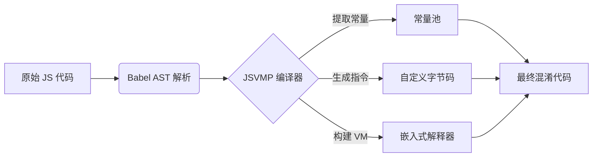
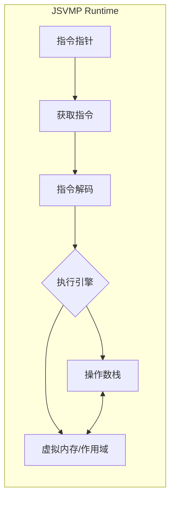

# 🛡️ Cy JSVMP - Enterprise JavaScript Virtualization Protection

[](README.md)
[](README.md)
[](README.md)

**Cy JSVMP** 是一款基于 **Babel AST** 和 **自定义堆栈虚拟机** 的企业级 JavaScript 代码混淆与保护工具。它通过将原生 JS 代码编译为自定义字节码，并在浏览器或 Node.js 环境中通过私有解释器运行，从而实现极高强度的反逆向工程保护。

> **安全产品体验**: [https://tsvmp.com](https://tsvmp.com) | [https://jsvmp.top](https://jsvmp.top)
>
> **验证仓库**: [https://github.com/2833844911/ciyverify](https://github.com/2833844911/ciyverify)

## ✨ 核心特性

### 🛡️ 虚拟化保护 (Virtualization)
- **自定义指令集**: 动态生成的 Opcode 映射，每次混淆可产生不同的指令集，加大逆向难度。
- **栈式虚拟机**: 基于堆栈架构的解释器，完全脱离原生 JS 执行流程。
- **沙盒执行**: 代码在独立的虚拟环境中运行，隐藏真实逻辑。

### 🌪️ 控制流平坦化 (Control Flow Flattening)
- **逻辑重组**: 将原来的 `if/else`, `while`, `for` 等控制流转换为扁平的 `switch-case` 结构。
- **状态机混淆**: 通过状态变量控制执行跳转，彻底破坏代码的可读性和控制流图 (CFG)。

### 🔒 数据加密与混淆 (Data Protection)
- **常量池加密**: 字符串、数字等常量被提取并索引化，甚至加密存储。
- **变量名重构**: 自动重命名变量为无意义的短字符，消除语义信息。

### 🛠️ AST 级深度处理
- **Babel 引擎**: 基于 `@babel/parser` 和 `@babel/generator`，确保对现代 JavaScript 语法的完整支持和精确转换。
- **语法降级**: 内置 ES6 转 ES5 功能，确保兼容性。

## 🏗️ 架构设计

### 混淆流程



### 虚拟机模型



## 📦 快速开始

### 1. 环境准备

确保已安装 Node.js 环境及相关依赖。

```bash
npm install
npm install @babel/parser
```

**前置要求**: JSVMP 主要支持 ES5 语法。如果你的代码是 ES6+，请先使用 Traceur 转码。

```bash
npm install -g traceur
```

> 📚 **ES5 转换教程**: [https://blog.csdn.net/qq_46013295/article/details/128481895](https://blog.csdn.net/qq_46013295/article/details/128481895)

### 2. 执行混淆

将需要保护的代码放入 `src/` 目录，然后根据需求选择不同的构建脚本。

```bash
node main_pro.js
```

### 3. 构建产物压缩

混淆后的代码通常较大，可以使用 `uglifyjs` 进行压缩：

```bash
# 混淆压缩
uglifyjs out.js --mangle --output out2.js

# 压缩+混淆
uglifyjs out.js --compress --mangle --output out3.js
```

## 📂 项目结构与功能

*   `main.js`: **正常调试版** (不推荐直接使用)，用于开发调试字节码生成逻辑。
*   `jiamian.js`: **加密版**，包含完整的指令集打乱功能，安全性高。
*   `jiajianbian.js`: **快速加密版**，牺牲少量安全性换取更快的保护速度。
*   `main_pro.js`: **升级版**，包含最新的特性和优化。
*   `src/`: 源代码输入目录。
*   `dist/`: 混淆代码输出目录。
*   `tool/`: 核心工具集 (VM 模板、AST 工具等)。

## ⚠️ 注意事项

- **性能影响**: 由于代码在虚拟机中解释执行，运行速度会比原生 JS 稍慢，建议用于核心逻辑或关键算法保护。
- **调试困难**: 混淆后的代码极难调试，请在发布前确保逻辑正确。

## 🤝 贡献与支持

**作者**: 陈不不  
**邮箱**: 2833844911@qq.com

> 📢 **JSVMP 反编译课程**
>
> 已经开设 JSVMP 反编译相关课程，需要报名的同学可以咨询 **WX: Chankipen**

本项目为私有保护工具，严禁用于非法用途。

---

*Powered by Cy JSVMP Protection Engine*
